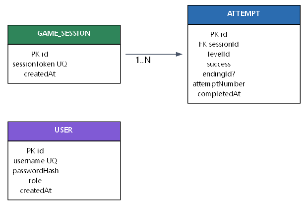

# Modelo Entidad-Relación

```{=typst}
#v(1em)
```

El modelo de datos de la plataforma **Mairin: El retrato roto** se compone de
tres entidades: `User` (usuario autenticado), `GameSession` (sesión de juego) y
`Attempt` (intento). La primera sustenta la autenticación y el control de acceso
por roles; las otras dos registran el progreso del jugador.



El diagrama muestra tres entidades. `users` identifica a quienes acceden al
sistema y les asigna un rol —administrador, usuario o auditor—; conserva su
nombre de usuario, su contraseña cifrada y la fecha de creación. `game_sessions`
representa la sesión anónima de juego y `attempts`, cada intento del jugador,
guardando el nivel jugado, el resultado, el final alcanzado, el número de intento
y la fecha de finalización. Las dos últimas se relacionan de uno a muchos: una
sesión puede acumular varios intentos, pero cada intento pertenece a una sola
sesión. La entidad `users` se mantiene independiente, ya que las sesiones siguen
siendo anónimas y aún no se vinculan a un usuario autenticado.

# Relaciones

```{=typst}
#v(1em)
```

La conexión entre las entidades se detalla a continuación.

| Relación | Cardinalidad | Implementación |
|----------|--------------|----------------|
| GameSession → Attempt | 1:N | `attempts.sessionId` → `game_sessions.id` |

**Cardinalidad 1:N.** Una fila de `game_sessions` puede estar referenciada por
muchas filas de `attempts` (un jugador realiza varios intentos a lo largo de su
sesión). A la inversa, cada fila de `attempts` referencia exactamente una fila
de `game_sessions`, porque `sessionId` es una clave foránea no nula hacia
`game_sessions.id`.

La tabla `users` no mantiene una clave foránea hacia las demás: su propósito es
únicamente la autenticación y la asignación de roles, mientras que el progreso
se registra por sesión anónima (`sessionToken`).

# Llaves

```{=typst}
#v(1em)
```

| Tabla | Campo | Tipo de llave | Referencia |
|-------|-------|---------------|------------|
| users | id | PK | — |
| users | username | UK | — |
| game_sessions | id | PK | — |
| game_sessions | sessionToken | UK | — |
| attempts | id | PK | — |
| attempts | sessionId | FK | game_sessions.id |
| attempts | (sessionId, levelId, attemptNumber) | UK compuesta | — |

- **PK (clave primaria):** identifica de forma única cada fila.
- **FK (clave foránea):** referencia la clave primaria de otra tabla.
- **UK (clave única / candidata):** garantiza unicidad adicional a la PK.

# Segunda Forma Normal (2FN)

```{=typst}
#v(1em)
```

Una relación se encuentra en **Segunda Forma Normal (2FN)** si cumple dos
condiciones: (1) ya se encuentra en **1FN** y (2) todo atributo no clave
depende de la *totalidad* de la clave primaria, sin dependencias parciales
sobre una parte de una clave compuesta.

**1FN.** Todas las tablas están en Primera Forma Normal: sus atributos son
atómicos, sin listas ni grupos repetidos. Por ejemplo, `success` es un booleano,
`levelId` una cadena simple, `attemptNumber` un entero y `role` un valor de
enumeración; ninguno contiene conjuntos de valores.

**2FN.** La segunda condición es la relevante cuando existen claves primarias
compuestas. En este modelo:

- `users` tiene clave primaria simple (`id`), por lo que no puede existir
  dependencia parcial: todo atributo no clave (`username`, `passwordHash`,
  `role`, `createdAt`) depende de la clave completa.
- `game_sessions` también tiene clave primaria simple (`id`): sus atributos no
  clave (`sessionToken`, `createdAt`) dependen de la clave completa.
- `attempts` tiene clave primaria simple (`id`). Además posee una clave candidata
  compuesta `(sessionId, levelId, attemptNumber)`; aun considerándola, ningún
  atributo no clave (`success`, `endingId`, `completedAt`) depende de una *parte*
  de esa clave: todos dependen del intento completo, identificado por la terna
  (sesión, nivel, número de intento).

Por lo tanto, al no presentar dependencias parciales respecto de claves
primarias compuestas, el modelo cumple la **Segunda Forma Normal (2FN)**.

# Diccionario de datos

```{=typst}
#v(1em)
```

## Tabla `users`

| Campo | Tipo PostgreSQL | Prisma | PK | FK | Nulo | Único | Default | Descripción |
|-------|-----------------|--------|----|----|------|-------|---------|-------------|
| id | TEXT | String | Sí | No | No | No | `uuid()` | Identificador único del usuario |
| username | TEXT | String | No | No | No | Sí | — | Nombre de usuario único |
| passwordHash | TEXT | String | No | No | No | No | — | Contraseña cifrada (scrypt + salt) |
| role | "Role" | Role | No | No | No | No | `USUARIO` | Rol del usuario (ADMIN / USUARIO / AUDITOR) |
| createdAt | TIMESTAMP(3) | DateTime | No | No | No | No | `now()` | Fecha de creación |

## Tabla `game_sessions`

| Campo | Tipo PostgreSQL | Prisma | PK | FK | Nulo | Único | Default | Descripción |
|-------|-----------------|--------|----|----|------|-------|---------|-------------|
| id | TEXT | String | Sí | No | No | No | `uuid()` | Identificador único de la sesión |
| sessionToken | TEXT | String | No | No | No | Sí | — | Token anónimo del jugador |
| createdAt | TIMESTAMP(3) | DateTime | No | No | No | No | `now()` | Fecha de creación |

## Tabla `attempts`

| Campo | Tipo PostgreSQL | Prisma | PK | FK | Nulo | Único | Default | Descripción |
|-------|-----------------|--------|----|----|------|-------|---------|-------------|
| id | TEXT | String | Sí | No | No | No | `uuid()` | Identificador único del intento |
| sessionId | TEXT | String | No | Sí | No | No | — | Sesión a la que pertenece (→ game_sessions.id) |
| levelId | TEXT | String | No | No | No | No | — | Nivel jugado (identificador opaco) |
| success | BOOLEAN | Boolean | No | No | No | No | — | Indica si el intento fue exitoso |
| endingId | TEXT | String | No | No | Sí | No | — | Final alcanzado (opcional) |
| attemptNumber | INTEGER | Int | No | No | No | No | — | Número de intento dentro de la sesión y nivel |
| completedAt | TIMESTAMP(3) | DateTime | No | No | No | No | `now()` | Fecha de finalización |

*Nota:* `attempts` define la clave única compuesta `(sessionId, levelId,
attemptNumber)`, que impide registrar dos intentos con el mismo número para la
misma sesión y nivel. El tipo enumerado `"Role"` es un tipo de dato personalizado
de PostgreSQL con los valores `ADMIN`, `USUARIO` y `AUDITOR`.
